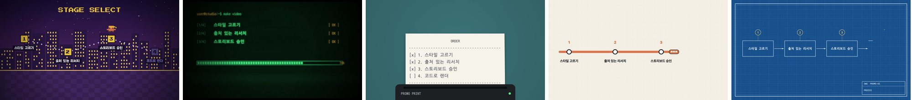
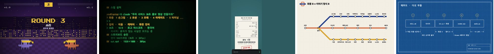

# handdrawn-promo-video

[English](README.md) | 한국어

[](https://github.com/Changroro/handdrawn-promo-video/releases/download/v1.0.0/SkillIntro.mp4)

*이 스킬로 만든 45초 소개 영상입니다. 누르면 전체 MP4를 볼 수 있습니다(소리 없음).*

주제(회사, 제품, 웹사이트)를 조사해 짧은 홍보 영상을 코드로 그려 MP4로 만드는 에이전트 스킬입니다.

- 먼저 화풍과 이야기 형식을 묻고, 이어서 길이, 비율, 캐릭터, 화면 언어를 묻습니다.
- 출처를 붙여 주제를 조사하고, 크게 보여줄 숫자는 원문 문장과 다시 대조합니다. 색과 폰트는 브랜드에서 가져옵니다.
- 스토리보드를 승인받은 뒤 작은 캔버스 키트로 장면을 만듭니다. rough.js 선 떨림, 키네틱 타이포, 카메라 이동, 전환, 픽셀 스프라이트, 모래, 영상 클립을 지원합니다.
- 화풍과 형식에 따라 음악과 효과음도 코드로 만듭니다.
- 스틸, 전환 구간, 전체 타임라인을 검수한 뒤 headless Chrome 병렬 렌더로 H.264 영상을 만듭니다.

## 화풍과 이야기 형식

모든 영상은 서로 독립적인 두 가지 선택으로 정해집니다. **화풍**(어떻게 그리는지)과 **이야기 형식**(어떻게 풀어가는지)입니다. 어떤 화풍이든 어떤 형식과도 조합할 수 있습니다.

| 화풍 | 느낌 | 원작자 |
|---|---|---|
| 손그림과 8비트 미니미(기본) | 발랄한 스케치북 | [@nahiddotai](https://www.threads.com/@nahiddotai/post/DdmtD3zDtkB) |
| 브랜드 모션그래픽 | 깔끔한 공식 자료 | [@digitalstrategyai](https://www.threads.com/@digitalstrategyai/post/DdpAYbcgAj0) |
| 모래 그림 | 따뜻한 이야기 | [@Michaelzsguo](https://x.com/Michaelzsguo/status/2102592355165782312) |
| 16비트 아케이드 | 게임, 활기찬 | 자체 제작 |
| CRT 터미널 | 개발자, 레트로 | 자체 제작 |
| 감열지 영수증 | 인쇄물, 손에 잡히는 | 자체 제작 |
| 노선도 | 도식, 정돈된 | 자체 제작 |
| 청사진 | 기술 도면, 정밀한 | 자체 제작 |

| 이야기 형식 | 구성 | 원작자 |
|---|---|---|
| 기본 홍보(기본) | 훅 → 제목 → 단계 → 큰 숫자 → 엔딩 | 자체 제작 |
| 대전 | 두 선택지의 라운드별 대결과 합계 | 자체 제작 |
| 세션 | 명령과 출력으로 사용법을 보여줌 | 자체 제작 |
| 영수증 | 항목, 합계, 도장 | 자체 제작 |
| 노선도 | 노선, 역, 환승역 | 자체 제작 |
| 설계도 | 부품과 부품별 사양 | 자체 제작 |
| 가사형 뮤직비디오 | 창작곡, 한 줄에 사실 하나 | [@goodside](https://x.com/goodside/status/2102852546620744010) |
| 비트 싱크 실사 | 실제 영상을 음원 박자에 맞춰 편집 | [@twoclipping](https://x.com/twoclipping/status/2102554209166000267) |

### 미리보기

**같은 대본, 다섯 가지 화풍**: 아케이드, 터미널, 감열지, 노선도, 청사진 (대본 하나의 "단계" 장면, 이 스킬로 제작)


**이야기 형식 다섯 가지**: 대전, 세션, 영수증(9:16), 노선도, 설계도 (이 스킬로 만든 이 스킬 소개)


원작자들의 원본 영상에서 뽑은 하이라이트 4컷입니다.

**손그림과 8비트 미니미**, [@nahiddotai](https://www.threads.com/@nahiddotai/post/DdmtD3zDtkB) 원본


**브랜드 모션그래픽**, [@digitalstrategyai](https://www.threads.com/@digitalstrategyai/post/DdpAYbcgAj0) 원본


**모래 그림**, [@Michaelzsguo](https://x.com/Michaelzsguo/status/2102592355165782312) 원본


**가사형 뮤직비디오**, [@goodside](https://x.com/goodside/status/2102852546620744010) 원본


**비트 싱크 실사**, [@twoclipping](https://x.com/twoclipping/status/2102554209166000267) 원본


## 크레딧

원작자 표시가 있는 화풍과 형식은 원작자가 Claude Opus 5.5 공개 뒤 공개적으로 공유한 작업에서 착안했습니다. 링크는 위 표에 있습니다. 이 저장소에는 원작자들의 프롬프트 원문이 들어 있지 않습니다. `references/`의 가이드는 직접 새로 썼고, 모든 화풍과 형식에 같은 리서치, 승인, 검수 단계를 적용합니다. 자체 제작 표시가 있는 화풍과 형식은 이 스킬을 위해 새로 만들었습니다. 기본 화풍은 [@nahiddotai](https://www.threads.com/@nahiddotai)의 ["Introducing Opus 5.5" 런치 영상](https://www.threads.com/@nahiddotai/post/DdmtD3zDtkB)과 [공유된 프롬프트](https://www.threads.com/@nahiddotai/post/Ddm0OgZkuQx)에서 착안했습니다. 소개 영상에는 그 런치 영상의 장면이 출처와 함께 잠깐 나옵니다.

## 설치

하나를 고르세요.

**skills CLI** (Claude Code, Codex 등 여러 에이전트):

```bash
npx skills add Changroro/handdrawn-promo-video -g
```

**Claude Code 플러그인** ([changroro 마켓플레이스](https://github.com/Changroro/plugins)):

```
/plugin marketplace add Changroro/plugins
/plugin install handdrawn-promo-video@changroro
```

**직접 설치**: 에이전트의 스킬 폴더에 clone합니다.

```bash
git clone https://github.com/Changroro/handdrawn-promo-video ~/.claude/skills/handdrawn-promo-video   # Claude Code
git clone https://github.com/Changroro/handdrawn-promo-video ~/.codex/skills/handdrawn-promo-video    # Codex
```

필요한 것: npm이 포함된 Node.js 18 이상, libx264가 포함된 ffmpeg, Google Chrome, 보조 스크립트용 [uv](https://docs.astral.sh/uv/). 소리용 numpy와 scipy, 박자 분석용 librosa는 실행할 때 자동으로 설치됩니다.

## 사용법

에이전트에게 영상을 요청하면 됩니다. 예를 들면:

- "https://example.com 30초 홍보 영상 만들어줘"
- "우리 회사 소개 영상 만들어줘"
- "우리 회사 연혁을 모래 그림 영상으로 만들어줘"
- "요금제 두 개를 아케이드 대전 영상으로 비교해줘"

## 구성

| 경로 | 역할 |
|---|---|
| `SKILL.md` | 작업 흐름: 화풍·형식·설정 → 리서치 → 계획 승인 → 제작 → 검수 → 렌더 |
| `.claude-plugin/plugin.json` | Claude Code 플러그인 매니페스트(스킬은 저장소 최상위에 있음) |
| `template/kit.js` | 캔버스 키트: 손그림 도형, 텍스트와 키네틱 타이포, 카메라, 전환, 스프라이트, 미니미, 영상 클립 |
| `template/sand.js` | 빛 테이블 위 모래 그림(모래 그림 화풍용) |
| `template/{arcade,terminal,thermal,transit,blueprint}.js` | 공통 장면 API와 대표 형식 장면을 가진 화풍 모듈 |
| `template/render.mjs` | 병렬 페이지로 프레임을 결정적으로 캡처해 ffmpeg로 인코딩하고 오디오 트랙을 합침 |
| `template/minis-ai.js` | AI 관련 주제용 미니미 캐릭터 세트 |
| `references/` | 리서치 절차, 스토리보드 패턴, 키트 API, 검수 체크리스트 |
| `references/looks.md`, `references/formats.md` | 화풍 모듈과 이야기 형식 |
| `references/styles/` | 원작자가 있는 화풍과 형식의 가이드 |
| `scripts/` | 폰트 다운로드, 로고 배경 정리, 검수용 시트, 음악·효과음 합성, 박자 분석 |

폰트는 제작할 때 Google Fonts와 jsDelivr에서 내려받으며(SIL Open Font License), 저장소에 포함하지 않았습니다.

`template/minis-ai.js`의 캐릭터는 비공식 팬아트입니다. 제품명과 상표는 각 소유자에게 있습니다.

## 라이선스

[MIT](LICENSE)
