# code-video

[English](README.md) | 한국어

<a href="docs/hero-45s.mp4">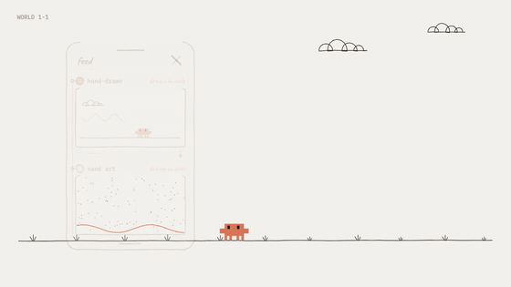</a>

*Claude Opus 5.5와 Claude Sonnet 5.5가 피드를 코드로 그린 영상으로 채워서, 두 모델을 위한 스킬을 대장간처럼 벼려 냈습니다. 이 소개 영상도 그 스킬로 만들었고, 모든 프레임을 코드로 그렸습니다.* [45초 MP4 보기](docs/hero-45s.mp4).

## 두 모델을 위해 벼린 스킬

code-video는 주제, 디자인, 형식을 받아 전부 코드로 그린 MP4로 만들어 줍니다. Claude Opus 5.5와 Claude Sonnet 5.5 두 모델에서 모두 사용할 수 있습니다.

주제를 조사해 짧은 영상을 전부 코드로 그려 주는 에이전트 스킬입니다. 주제와 화풍(아래 프리셋, 아무 사이트의 DESIGN.md, 또는 말로 설명한 어떤 느낌이든)을 주면 MP4가 나옵니다. 영상 생성 모델도, 스톡 영상도 쓰지 않습니다. 에이전트가 장면을 코드로 짜고, 한 프레임씩 렌더해서 MP4로 건네줍니다.

## 동작 원리

1. **전부 코드입니다.** 매 프레임을 "시간 t일 때의 그림"으로 HTML 캔버스에 그리고, headless Chrome으로 찍어 ffmpeg로 인코딩합니다. 음악과 효과음도 코드로 합성하기 때문에 같은 입력이면 늘 같은 영상이 나옵니다.
2. **조사가 먼저입니다.** 출처가 있는 사실을 10개 안팎 모으고, 색과 폰트는 브랜드에서 가져옵니다. 화면의 모든 숫자에 출처가 있습니다.
3. **디자인, 조사, 형식만 주면 됩니다.** 어떻게 보일지(화풍, 브랜드 프리셋, 아무 사이트의 DESIGN.md, 또는 말로 설명한 어떤 느낌이든), 주제, 길이·비율·언어를 주면 이야기는 에이전트가 짜고, 만들기 전에 짧은 계획을 보여줍니다.
4. **규칙은 일부러 적게 뒀습니다.** 스킬은 화풍과 꼭 필요한 규칙 하나(숫자 출처)만 주고 이야기는 에이전트에게 맡깁니다. A/B 테스트에서 과정 규칙을 덜어내자 품질 차이 없이 영상 한 편 비용이 23–51% 줄었습니다.
5. **빠르게 다시 만들 수 있습니다.** 여러 headless Chrome 페이지에서 병렬로 렌더하고 JPEG로 캡처해, 10코어 노트북에서 45초 1080p 영상을 약 1분 만에 렌더합니다. 테스트에서는 리서치부터 MP4까지 한 번에 4–13분이 걸렸습니다.

## 갤러리

화풍마다 예시 영상에서 몇 초씩 잘랐습니다. 모든 예시는 이 스킬만 가진 새 에이전트가 이 스킬을 주제로 만든 영상이며, 전체 MP4는 [최신 릴리즈](https://github.com/Changroro/code-video/releases/latest)에 있습니다. 예시 영상의 화면 언어는 영어입니다. 화풍은 계속 추가되며, 새 화풍 PR도 환영합니다([기여하기](#기여하기) 참고).

브랜드 프리셋은 각 사이트의 공개된 디자인 언어만 빌렸으며, 이 프로젝트는 해당 회사들과 관계가 없습니다.

<table>
<tr>
<td width="25%" align="center" valign="bottom"><b>손그림</b> · <a href="https://www.threads.com/@nahiddotai/post/DdmtD3zDtkB">@nahiddotai</a><br>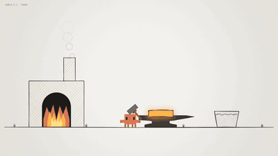</td>
<td width="25%" align="center" valign="bottom"><b>브랜드 모션그래픽</b> · <a href="https://www.threads.com/@digitalstrategyai/post/DdpAYbcgAj0">@digitalstrategyai</a><br>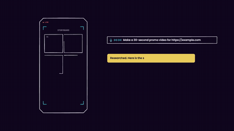</td>
<td width="25%" align="center" valign="bottom"><b>모래 그림</b> · <a href="https://x.com/Michaelzsguo/status/2102592355165782312">@Michaelzsguo</a><br>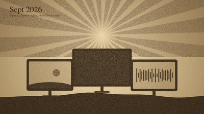</td>
<td width="25%" align="center" valign="bottom"><b>가사형 뮤직비디오</b> · <a href="https://x.com/goodside/status/2102852546620744010">@goodside</a><br>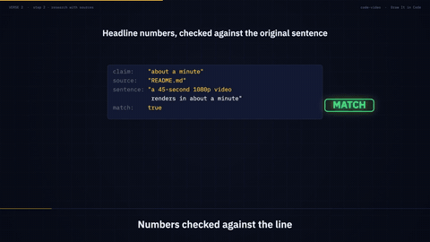</td>
</tr>
<tr>
<td width="25%" align="center" valign="bottom"><b>비트 싱크 실사</b> · <a href="https://x.com/twoclipping/status/2102554209166000267">@twoclipping</a><br>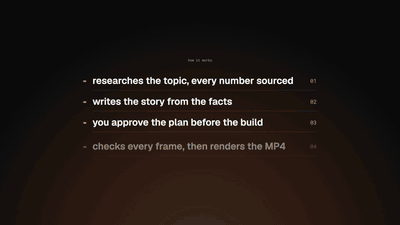</td>
<td width="25%" align="center" valign="bottom"><b>UI 모프</b> · <a href="https://x.com/twoclipping/status/2103273003555402193">@twoclipping</a><br>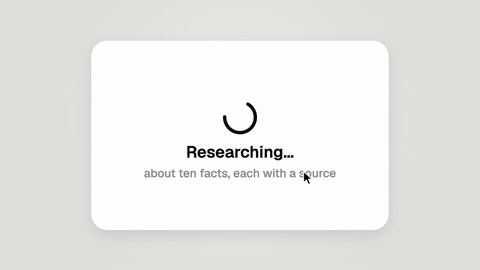</td>
<td width="25%" align="center" valign="bottom"><b>히어로 코믹스</b><br>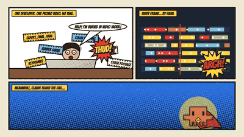</td>
<td width="25%" align="center" valign="bottom"><b>스크랩북</b><br>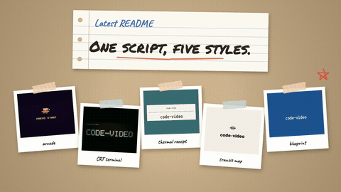</td>
</tr>
<tr>
<td width="25%" align="center" valign="bottom"><b>찢은 종이 콜라주</b><br>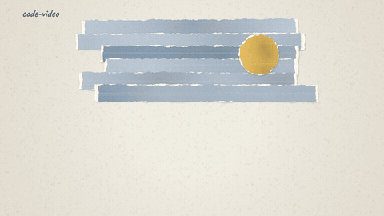</td>
<td width="25%" align="center" valign="bottom"><b>파티클</b><br>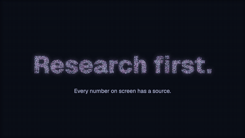</td>
<td width="25%" align="center" valign="bottom"><b>스플릿플랩 전광판</b><br>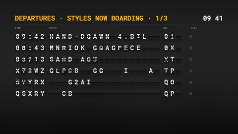</td>
<td width="25%" align="center" valign="bottom"><b>네온사인</b><br>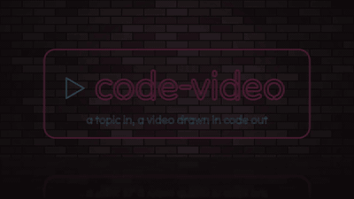</td>
</tr>
<tr>
<td width="25%" align="center" valign="bottom"><b>16비트 아케이드</b><br>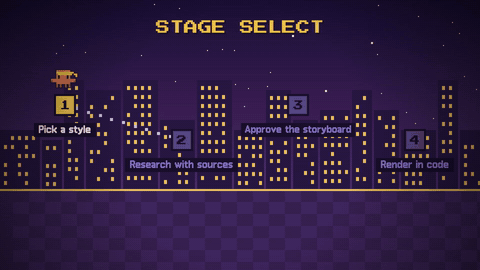</td>
<td width="25%" align="center" valign="bottom"><b>CRT 터미널</b><br>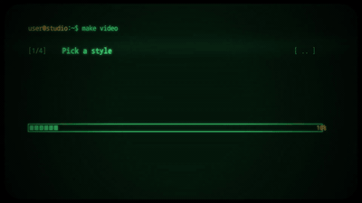</td>
<td width="25%" align="center" valign="bottom"><b>감열지 영수증</b><br>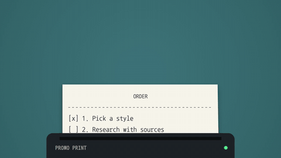</td>
<td width="25%" align="center" valign="bottom"><b>노선도</b><br>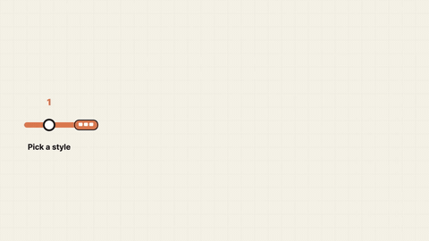</td>
</tr>
<tr>
<td width="25%" align="center" valign="bottom"><b>청사진</b><br>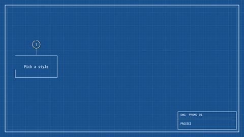</td>
<td width="25%" align="center" valign="bottom"><b>애플풍 쇼룸</b><br>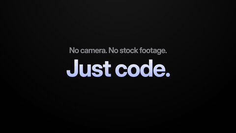</td>
<td width="25%" align="center" valign="bottom"><b>삼성풍 테크 런칭</b><br>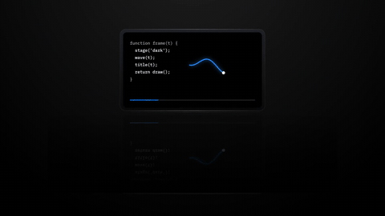</td>
<td width="25%" align="center" valign="bottom"><b>페라리풍 레이싱 럭셔리</b><br>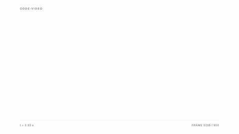</td>
</tr>
<tr>
<td width="25%" align="center" valign="bottom"><b>나이키풍 애슬레틱</b><br>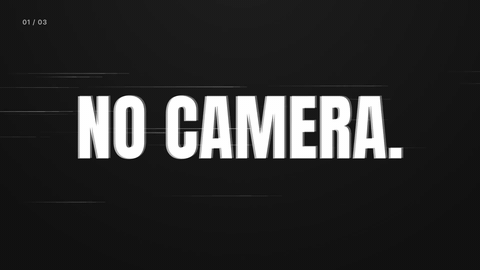</td>
<td width="25%" align="center" valign="bottom"><b>스포티파이풍 다크 미디어</b><br>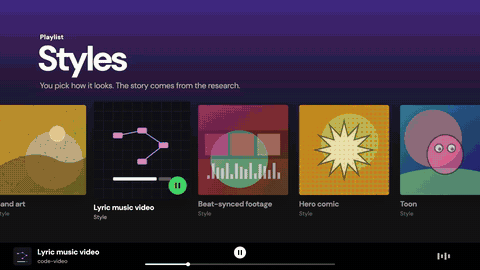</td>
<td width="25%" align="center" valign="bottom"><b>DESIGN.md로 만든 예(Stripe)</b><br>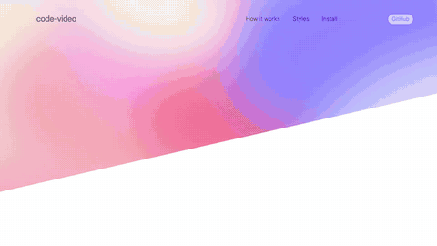</td>
<td width="25%" align="center" valign="bottom"><b>코믹북</b><br>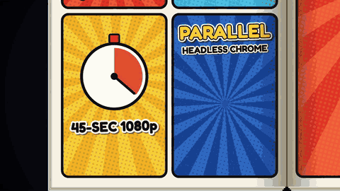</td>
</tr>
<tr>
<td width="25%" align="center" valign="bottom"><b>다큐멘터리</b><br>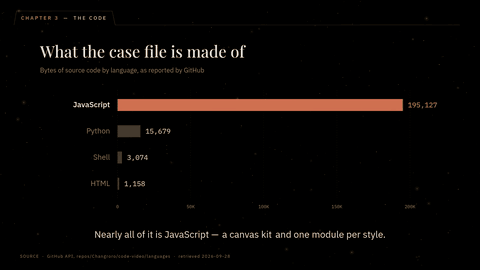</td>
<td width="25%" align="center" valign="bottom"><b>박물관 전시</b><br>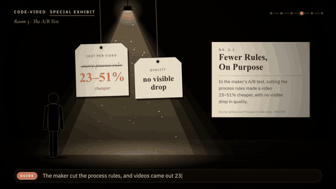</td>
<td width="25%" align="center" valign="bottom"><b>뉴스 속보</b><br>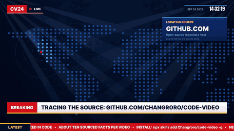</td>
<td width="25%" align="center" valign="bottom"><b>탐정 수사 보드</b><br>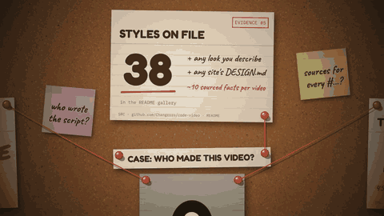</td>
</tr>
<tr>
<td width="25%" align="center" valign="bottom"><b>그림책 동화</b><br>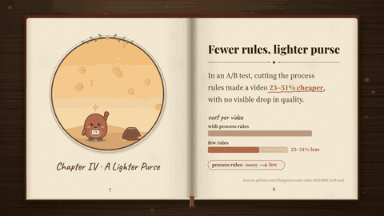</td>
<td width="25%" align="center" valign="bottom"><b>RPG 퀘스트</b><br>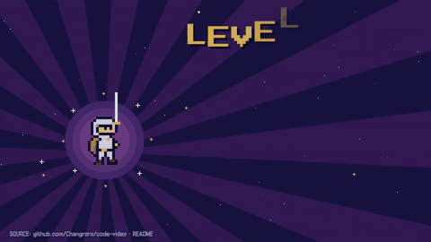</td>
<td width="25%" align="center" valign="bottom"><b>일기예보</b><br>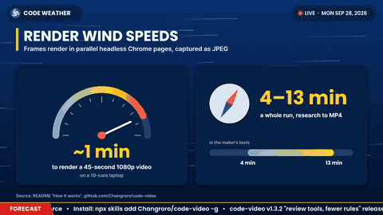</td>
<td width="25%" align="center" valign="bottom"><b>홈쇼핑 인포머셜</b><br>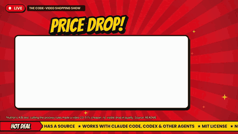</td>
</tr>
<tr>
<td width="25%" align="center" valign="bottom"><b>스포츠 중계</b><br>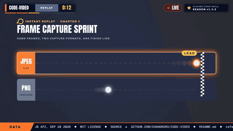</td>
<td width="25%" align="center" valign="bottom"><b>조립 설명서</b><br>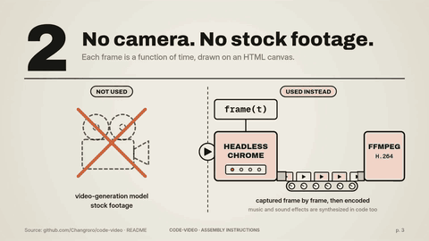</td>
<td width="25%" align="center" valign="bottom"><b>화이트보드 강의</b><br>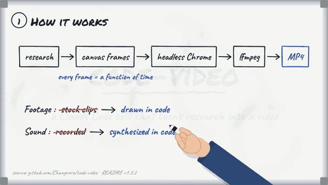</td>
<td width="25%" align="center" valign="bottom"><b>영화 예고편</b><br>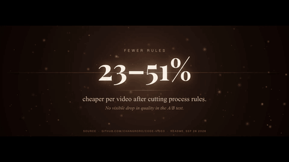</td>
</tr>
<tr>
<td width="25%" align="center" valign="bottom"><b>칠판 수학 강의</b><br>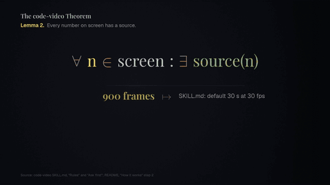</td>
<td width="25%" align="center" valign="bottom"><b>자유 화풍(에이전트에게 맡김)</b><br>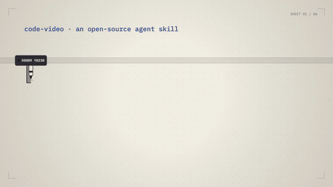</td>
<td width="25%"></td>
<td width="25%"></td>
</tr>
</table>

## 설치

하나를 고르세요.

**skills CLI** (Claude Code, Codex 등 여러 에이전트):

```bash
npx skills add Changroro/code-video -g
```

**Claude Code 플러그인** ([changroro 마켓플레이스](https://github.com/Changroro/plugins)):

```
/plugin marketplace add Changroro/plugins
/plugin install code-video@changroro
```

**직접 설치**: 에이전트의 스킬 폴더에 clone합니다.

```bash
git clone https://github.com/Changroro/code-video ~/.claude/skills/code-video   # Claude Code
git clone https://github.com/Changroro/code-video ~/.codex/skills/code-video    # Codex
```

필요한 것: npm이 포함된 Node.js 18 이상, libx264가 포함된 ffmpeg, Google Chrome, 보조 스크립트용 [uv](https://docs.astral.sh/uv/). 소리용 numpy와 scipy, 박자 분석용 librosa는 실행할 때 자동으로 설치됩니다.

## 사용법

에이전트에게 영상을 요청하면 됩니다. 원하는 화풍이 있으면 함께 말하고, 없으면 주제에 맞춰 추천받으면 됩니다.

- "https://example.com 30초 홍보 영상 만들어줘"
- "우리 회사 연혁을 모래 그림 영상으로 만들어줘"
- "요금제 두 개를 아케이드 화풍으로 비교해줘"
- "우리 앱 출시 영상을 코믹스 화풍으로 만들어줘"

에이전트의 추론 강도를 높이면 움직임이 더 섬세해지는 편입니다.

## 구성

| 경로 | 역할 |
|---|---|
| `SKILL.md` | 작업 흐름: 디자인·조사·형식 → 짧은 계획 → 제작 → 렌더 |
| `.claude-plugin/plugin.json` | Claude Code 플러그인 매니페스트(스킬은 저장소 최상위에 있음) |
| `template/kit.js` | 렌더 뼈대: 캔버스 준비, 장면 시간, 프레임 렌더, 폰트 로딩, 모션 블러 |
| `template/render.mjs` | 병렬 페이지로 프레임을 결정적으로 캡처해 ffmpeg로 인코딩하고 오디오 트랙을 합침 |
| `references/` | 키트 API |
| `references/styles/` | 화풍별 가이드(시그니처 표 포함) |
| `scripts/` | 폰트 다운로드, 로고 배경 정리, 검수용 시트, 원작 비교 시트, 음악·효과음 합성, 박자 분석 |

폰트는 제작할 때 Google Fonts와 jsDelivr에서 내려받으며(SIL Open Font License, Apache 2.0), 저장소에 포함하지 않았습니다.

## 기여하기

PR을 환영합니다. 새 화풍이면 더 좋습니다.

- **새 화풍**: `references/styles/`에 `# Style: <이름>`과 짧은 설명으로 시작하고, 그 화풍을 만드는 요소를 시그니처 표로 정리한 가이드를 넣은 뒤, README 두 곳의 갤러리에 GIF를 추가해 주세요. 가이드에는 그 화풍을 정의하는 것(팔레트, 폰트, 핵심 특징)과 절대 어기면 안 되는 규칙만 적고, 이야기·소리·그리는 방법은 에이전트에게 맡기며 헬퍼 코드는 넣지 않습니다.
- **다른 사람의 공개 작업을 참고할 때**: 원작자를 링크와 함께 표기하고, 가이드는 직접 쓴 문장으로 작성하며(프롬프트 원문은 넣지 않음), 원본 영상 4컷을 `docs/styles/`에 넣어 누구나 비교할 수 있게 해 주세요.
- **확인 방법**: `node render.mjs stills ...`로 스틸을 뽑고, 원작자가 있는 화풍이면 `scripts/reference_sheet.py <key> <영상> <out.jpg>`로 원본 아래에 결과 프레임을 붙여 비교해 주세요.
- 엔진, 폰트, 가이드의 버그 제보와 수정도 똑같이 환영합니다. 큰 변경은 이슈를 먼저 열어 주세요.

## 라이선스

[MIT](LICENSE)
