# code-video

English | [한국어](README.ko.md)

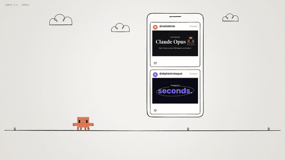

*Claude Opus 5.5 filled my feed with videos drawn in code, so I forged a skill for it. This intro was made with that skill, every frame drawn in code.* [Watch the 45-second MP4](https://github.com/Changroro/code-video/releases/download/v1.3.1/CodeVideo_intro_en.mp4).

An agent skill that researches a topic and turns it into a short video drawn entirely in code. Give it a topic and a style (one of the presets below, any site's DESIGN.md, or a look described in your own words) and get an MP4. No video-generation model and no stock footage: the agent writes the scenes, renders them frame by frame, and hands you the file.

## How it works

1. **Everything is code.** Each frame is a function of time drawn on an HTML canvas, captured by headless Chrome, and encoded by ffmpeg. Music and sound effects are synthesized in code too, so the same input always renders the same video.
2. **Research first.** The agent collects about ten facts with sources and takes the palette and fonts from the brand. Every number on screen has a source.
3. **Design, research, format.** You give the look (a style, a brand preset, any site's DESIGN.md, or any look in your own words), the topic, and the length, frame, and language. The agent writes the story that fits and shows you a short plan before it builds.
4. **Few rules, on purpose.** The skill hands the agent the look and a handful of hard rules (sourced numbers, no brand logos, credit to the originals) and leaves the story to it. In our A/B test, cutting the process rules made a video 23–51% cheaper with no visible drop in quality.
5. **Fast enough to iterate.** Frames render in parallel headless Chrome pages and are captured as JPEG: a 45-second 1080p video renders in about a minute on a 10-core laptop, and a whole run from research to MP4 took 4–13 minutes in our tests.

## Styles

| Style | Feel | Credit |
|---|---|---|
| Hand-drawn + 8-bit minis (default) | playful, sketchbook | [@nahiddotai](https://www.threads.com/@nahiddotai/post/DdmtD3zDtkB) |
| Brand motion graphics | clean, official | [@digitalstrategyai](https://www.threads.com/@digitalstrategyai/post/DdpAYbcgAj0) |
| Sand art | warm, story-like | [@Michaelzsguo](https://x.com/Michaelzsguo/status/2102592355165782312) |
| Lyric music video | an original song, a diagram per line | [@goodside](https://x.com/goodside/status/2102852546620744010) |
| Beat-synced footage | your own clips cut on the beat | [@twoclipping](https://x.com/twoclipping/status/2102554209166000267) |
| UI morph | one shape morphing through product UI | [@twoclipping](https://x.com/twoclipping/status/2103273003555402193) |
| Hero comic | bold, dramatic | original |
| Toon | bright, bouncy | original |
| Scrapbook | personal, handmade | original |
| Torn-paper collage | calm, handmade | original |
| Particles | abstract, techy | original |
| Split-flap board | announcements, lists | original |
| Neon sign | nightlife, bold | original |
| 16-bit arcade | game, energetic | original |
| CRT terminal | developer, retro | original |
| Thermal receipt | printed, tactile | original |
| Transit map | diagram, orderly | original |
| Blueprint | technical, precise | original |
| Apple-style showroom | gallery white, product-first | apple.com design language |
| Samsung-style tech launch | black stage, reveals | samsung.com design language |
| Ferrari-style racing luxury | editorial, wide caps | ferrari.com design language |
| Nike-style athletic | fast, slammed type | nike.com design language |
| Spotify-style dark media | dark, colour from artwork | spotify.com design language |
| Any site or DESIGN.md | whatever you point it at | the reference's owner |
| Free style | any look you describe or show, or one the agent invents | you, or the look's creator |

New styles are added over time, and pull requests for new ones are welcome (see [Contributing](#contributing)).

## Gallery

A few seconds from an example in each style. Every example is a video about this skill, made by a fresh agent with only this skill; the full MP4s are in the [latest release](https://github.com/Changroro/code-video/releases/latest).

| **Hand-drawn** | **Brand motion graphics** | **Sand art** |
|---|---|---|
| 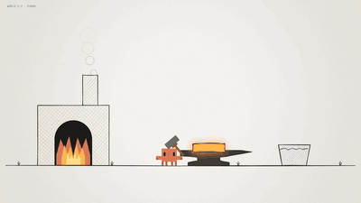 | 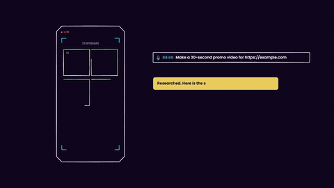 | 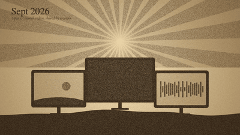 |
| **Lyric music video** | **Beat-synced footage** | **UI morph** |
| 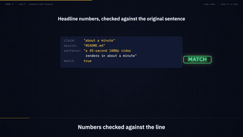 | 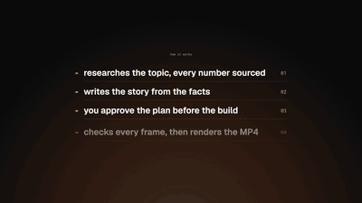 | 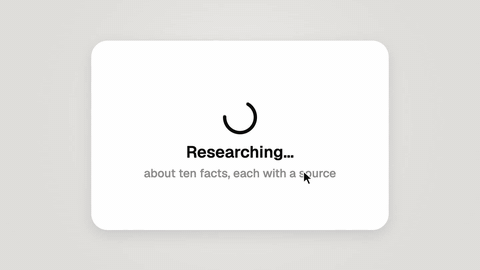 |
| **Hero comic** | **Toon** | **Scrapbook** |
| 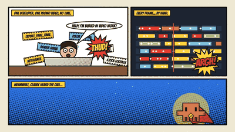 | 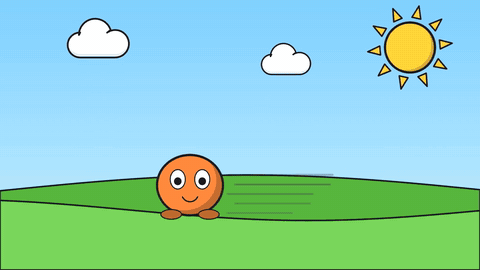 | 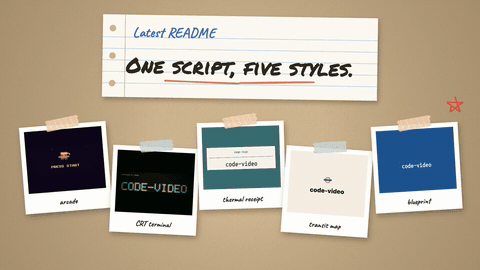 |
| **Torn-paper collage** | **Particles** | **Split-flap board** |
| 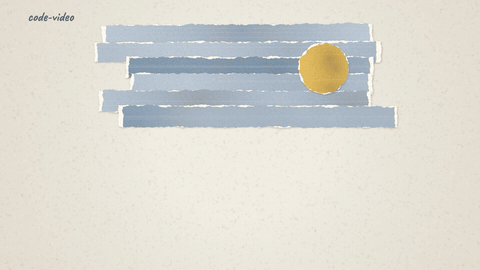 | 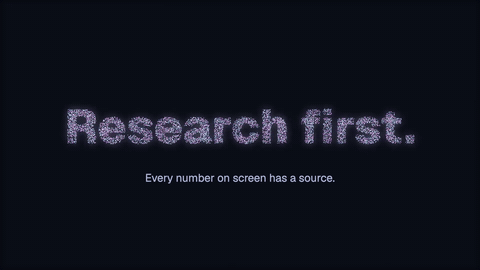 | 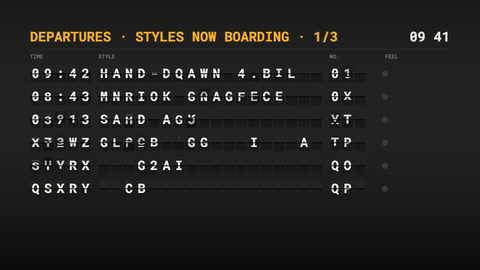 |
| **Neon sign** | **16-bit arcade** | **CRT terminal** |
| 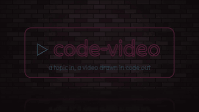 | 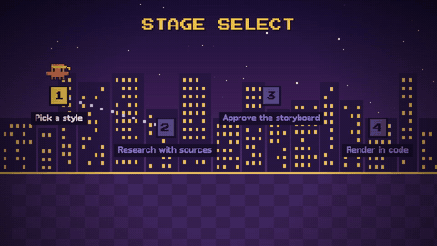 | 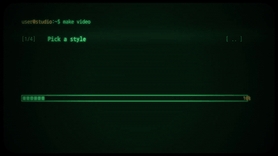 |
| **Thermal receipt** | **Transit map** | **Blueprint** |
| 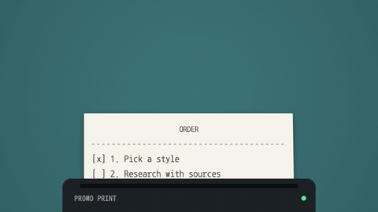 | 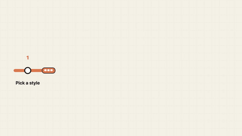 | 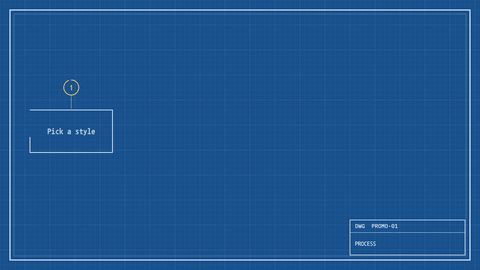 |
| **Apple-style showroom** | **Samsung-style tech launch** | **Ferrari-style racing luxury** |
| 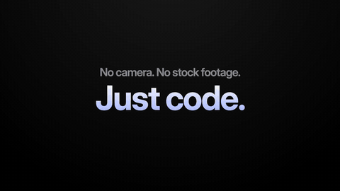 | 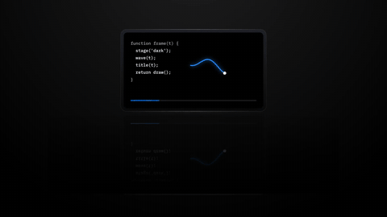 | 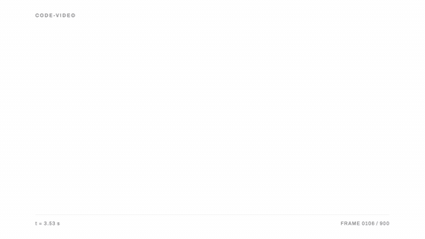 |
| **Nike-style athletic** | **Spotify-style dark media** | **From a DESIGN.md (Stripe)** |
| 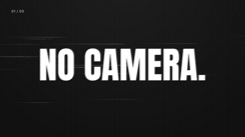 | 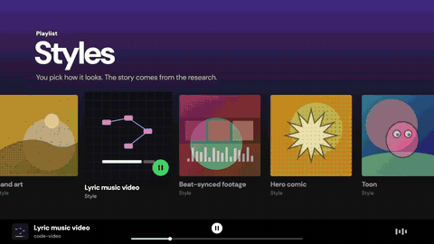 | 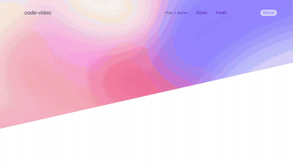 |
| **Free style (left to the agent)** |   |   |
| 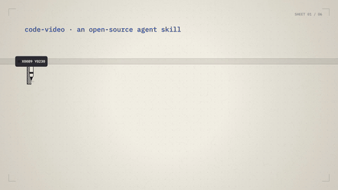 |   |   |

## Credit

Credited styles adapt ideas their creators shared publicly after the Claude Opus 5.5 release; the links are in the table above. This repository does not contain their prompts. The guides in `references/` are our own write-ups, and the skill wraps every style in the same research and approval steps. The styles marked original were designed for this skill. The brand-style presets borrow the public design language of apple.com, samsung.com, ferrari.com, nike.com, and spotify.com, taken from their DESIGN.md files in [VoltAgent/awesome-design-md](https://github.com/VoltAgent/awesome-design-md), [Refero](https://refero.design), and the sites' CSS. This project is not affiliated with those companies and uses no logos, slogans, or proprietary fonts. The default style comes from [@nahiddotai](https://www.threads.com/@nahiddotai)'s ["Introducing Opus 5.5" launch video](https://www.threads.com/@nahiddotai/post/DdmtD3zDtkB) and [the prompt they shared](https://www.threads.com/@nahiddotai/post/Ddm0OgZkuQx).

Four highlight frames from each credited creator's original video:

**Hand-drawn + 8-bit minis**, from [@nahiddotai](https://www.threads.com/@nahiddotai/post/DdmtD3zDtkB)
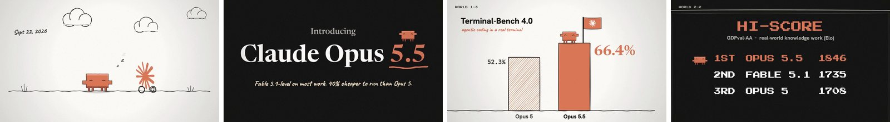

**Brand motion graphics**, from [@digitalstrategyai](https://www.threads.com/@digitalstrategyai/post/DdpAYbcgAj0)
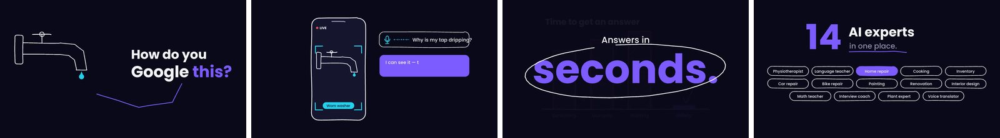

**Sand art**, from [@Michaelzsguo](https://x.com/Michaelzsguo/status/2102592355165782312)


**Lyric music video**, from [@goodside](https://x.com/goodside/status/2102852546620744010)


**Beat-synced footage**, from [@twoclipping](https://x.com/twoclipping/status/2102554209166000267)


**UI morph**, from [@twoclipping](https://x.com/twoclipping/status/2103273003555402193)
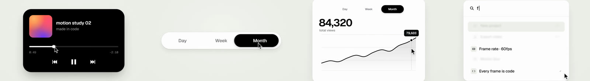

## Install

Pick one.

**skills CLI** (Claude Code, Codex and other agents):

```bash
npx skills add Changroro/code-video -g
```

**Claude Code plugin** from the [changroro marketplace](https://github.com/Changroro/plugins):

```
/plugin marketplace add Changroro/plugins
/plugin install code-video@changroro
```

**Manual**: clone into your agent's skills directory.

```bash
git clone https://github.com/Changroro/code-video ~/.claude/skills/code-video   # Claude Code
git clone https://github.com/Changroro/code-video ~/.codex/skills/code-video    # Codex
```

Requirements: Node.js 18+ with npm, ffmpeg built with libx264, Google Chrome, and [uv](https://docs.astral.sh/uv/) for the helper scripts (numpy and scipy for sound, librosa for beat detection, installed on the fly).

## Use

Ask your agent for a video. Name a style if you already know it, or let it suggest one from the topic.

- "Make a 30-second promo video for https://example.com"
- "Make a sand-art video of our company's history"
- "Compare our two plans in the arcade style"
- "Make a comic-style launch video for our app"

## Contents

| Path | Purpose |
|---|---|
| `SKILL.md` | Workflow: design, research, and format → a short plan → build → render |
| `.claude-plugin/plugin.json` | Claude Code plugin manifest (the skill stays at the repo root) |
| `template/kit.js` | Canvas kit: hand-drawn primitives, text and kinetic type, camera, transitions, sprites, minis, video clips, motion blur |
| `template/<style>.js` | One module per style with the helpers that draw its signature |
| `template/render.mjs` | Deterministic frame capture with parallel pages, piped to ffmpeg, with the audio track muxed in |
| `template/minis-ai.js` | Ready-made mini characters for AI-related topics |
| `references/` | Kit API and the scene-API styles |
| `references/styles/` | One guide per style, each with a Signature table |
| `scripts/` | Font download, logo background cleanup, contact sheets, reference sheets against the original, music and sound synthesis, beat detection |

Fonts are downloaded at build time from Google Fonts and jsDelivr (SIL Open Font License and Apache 2.0) and are not bundled.

The characters in `template/minis-ai.js` are unofficial fan art. Product names and trademarks belong to their owners.

## Contributing

Pull requests are welcome, especially new styles.

- **A new style**: add a module in `template/` (pure functions of time, no state between frames), a guide in `references/styles/` with a Signature table that maps every trait to a helper, a line in the style list of `SKILL.md`, and a row in both READMEs.
- **Adapting someone's public work**: credit the creator with a link, write the guide in your own words (do not paste their prompt), and add four frames from the original to `docs/styles/` so everyone can compare.
- **Check it**: render stills with `node render.mjs stills ...` and, for a credited style, build `scripts/reference_sheet.py <key> <video> <out.jpg>` to put your frames under the original's.
- Bug reports and fixes to the engine, fonts, or guides are just as welcome. Open an issue first for large changes.

## License

[MIT](LICENSE)
